# T2A2 - Marketplace: The Cardboard Cache

### **Installation:**
- After downloading the local files, run `rails db:create`
- Secondly, migrate the database with `rails db:migrate`
- Finally, to load in a sample of the top board games into the application run `rails populate`
    - This is likely to only load in ~30 board games

### **R7 - The Problem:**

For many members in the board game community, a large number of board games in every collection end up sitting on the shelf collecting dust. Due to high frequency of new game releases, board game enthusiasts tend to pick up more games than they can reasonably get to the tabletop. Additionally, a lot of games have an immense set of rules to learn, which provides a barrier to entry for new players and gaming groups. Consequently, more complex games or games that a group hasn't already learned the rules for rarely end up seeing any play time.

There is already a very active community of board game enthusiasts, many of which use existing platforms to buy and sell second hand board games. While it is possible to sell board games on existing platforms, there are a number of drawbacks to using them:
- eBay: Great general platform for buying and selling, but not very well tailored to board game sales, and includes transaction fees for sellers
- Facebook Marketplace: No transaction fees, but even less suitable for board game sales than eBay
- Geek Market (an existing board game marketplace, provided by 'Board Game Geeks'): Tailored for board game sales, but includes transaction fees for sellers

In addition to these platform specific issues, the second hand board game market is stifled by expensive shipping costs, due to the size and weight of most games, making sales not worthwhile for sellers and too expensive for buyers.

<br>

### **R8 - Why does it need solving?**

What if there was a way to trade board games, for free, with other board game enthusiasts without having to pay any additional shipping?

**This would allow all of the abandoned board games to finally get back to the tabletop, as originally intended by their creators.**

A key strategy for this approach would be to focus on board game trades between users, to encourage board game enthusiasts to try many different games they would otherwise not be able to afford (or fit in their game shelves).

<br>

### **R9 - Deployed Application:**
- https://the-cardboard-cache.herokuapp.com/

<br>

### **R10 - GitHub Repo:**
- https://github.com/waldowred5/the-cardboard-cache

<br>

### **R11 - Overview:**
- Purpose:
    - The Cardboard Cache (TCC) has been designed to allow local board game enthusiasts to swap games with each other. This allows users to refresh their board game collections without having to constantly purchase new games, and ensures old games get the tabletop more often
- Functionality & Features:
    - **User Accounts:** Users can create an account where they can save information about their board games collections and wishlists, as well as interact with other users. They can also optionally upload a photo of themselves as an avatar image (which is displayed in the navbar)
    - **Top Games:** Users can browse the top board game titles as found on the Board Game Geek (BGG) website. Users can view each of these titles for more detailed information about the game, as well as adding the game to their collections and wishlists
    - **Collections:** Users can save any games found on BGG, to a digital collection of games they own. They can edit each copy of their owned games by setting the status of those games to either a 'tradeable' game or a game 'not for trade', the condition of the game as well as a trade value (price) which they are willing to trade the game for
    - **Wishlists:** Users are able to pick games from the BGG database that they wish to own
    - **Trades:** Users can search for potential trade matches with other users. These trade matches include a succesfful trade, where User A has a game in their collection that User B has in their wishlist, and vice versa. Users can then request to trade these 2 games, which are saved as successful trades in TCC database when both parties have accepted the trade (currently, Trades functionality only includes searches for successful trades, requesting/accepting trades coming in a future release)
- Sitemap:
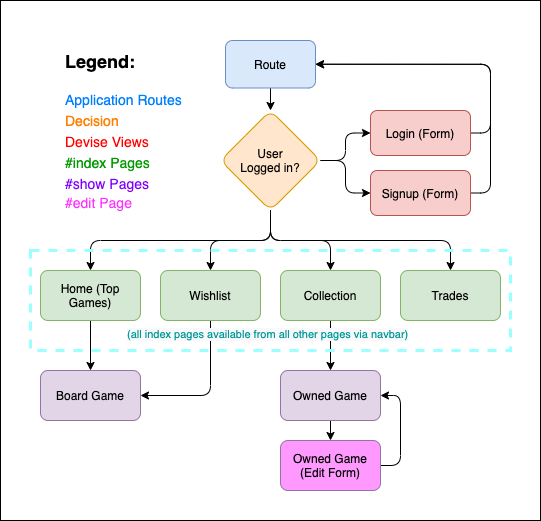

- <details>
    <summary>
    Website Screenshots (Click to expand):
    </summary>

    - Login Page:
    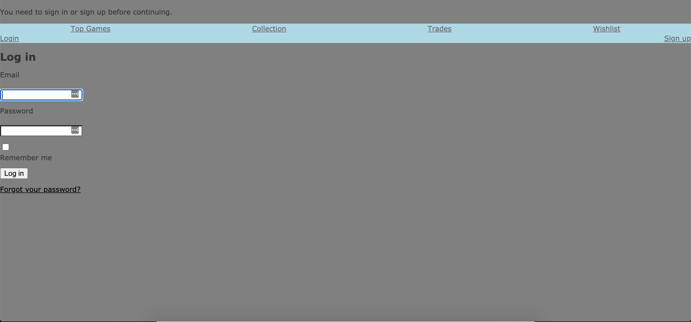
    - Signup Page:
    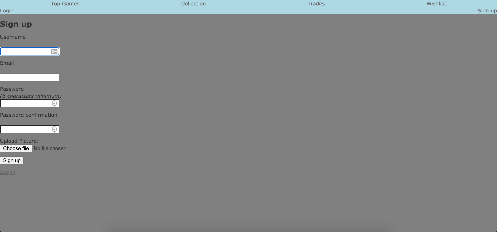
    - Home Page (Top Games):
    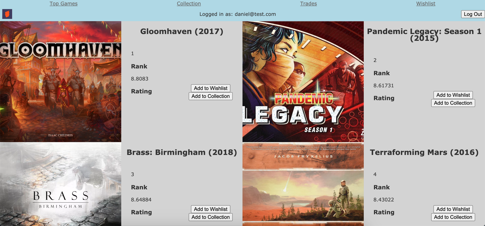
    - Show Board Game Page:
    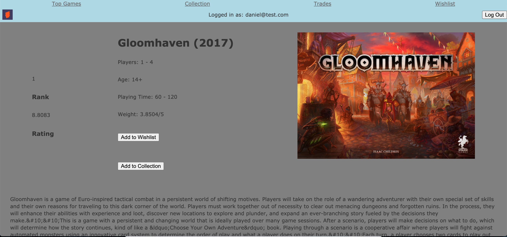
    - My Collection Page:
    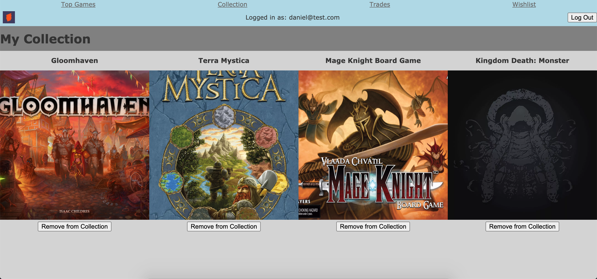
    - Show My Copy (Owned Game) Page:
    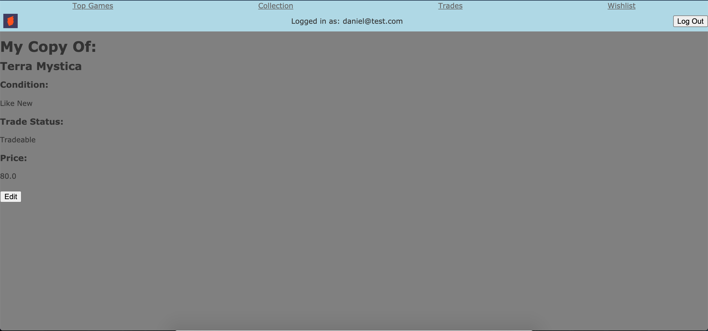
    - Edit My Copy (Owned Game) Form:
    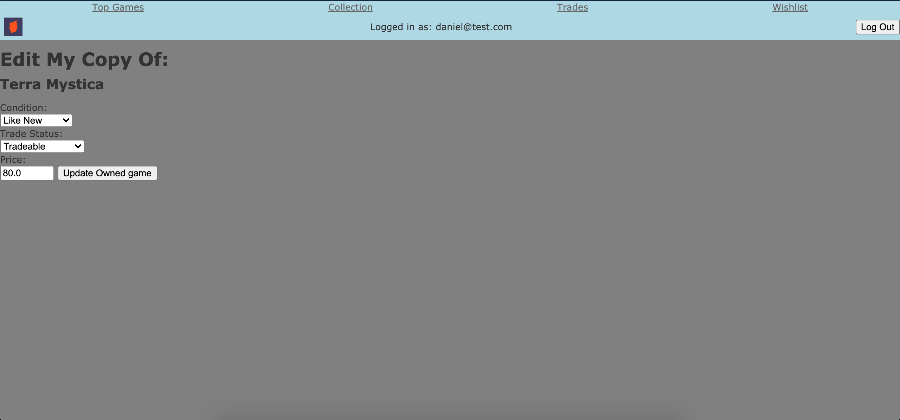
    - Wishlist Page:
    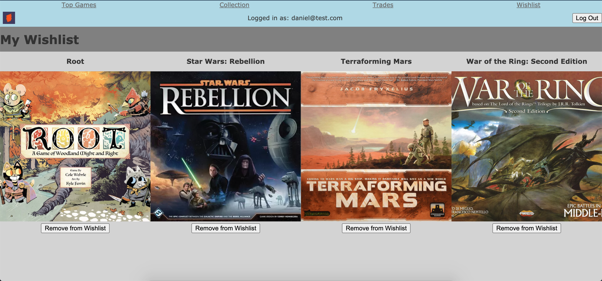
    - Trades Page:
    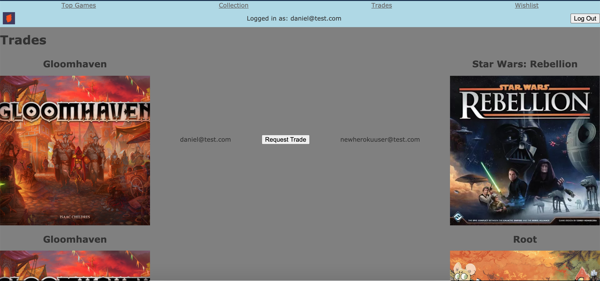
</details>

- Target Audience:
    - The primary audience for TCC is any board game enthusiast interested in trading their older games for games that other users are willing to trade
- Tech Stack:
    - Frontend: HTML5 (21.1%), SCSS (5.2%), Javascript (2.8%), CSS3 (0.5%)
    - Backend: Ruby 2.7.1 on Rails 6.0.3.4 (70.4%)
    - Database: PostgreSQL 12.3
    - Deployment: Heroku
    - Project Management: Github (Git), Trello
    - Design: Balsamiq Wireframes, Draw.io (ERD/Sitemap)
    - 3rd Party: Board Game Geek API ([BGG XML API2](https://boardgamegeek.com/wiki/page/BGG_XML_API2)), AWS (S3, IAM)

<br>

### **R13 - Wireframes:**

- <a href="docs/wireframes/the-cardboard-cache-wireframes.pdf">Wireframes (PDF)</a>

<br>

### **R12 - User Stories:**
- Users should be able to create an account that is password protected where they can save data about their board game preferences
- Users should be able to save games they own to a collection, and set the status of their owned games they are willing to trade as well as the condition of the game and the trade value (price) they are willing to trade their game for
- Users should be able to save games they want to a wishlist
- Users should be able to remove games from their collection or wishlist
- Users should be able to rank the priority of the games in their collections and wishlists (coming in a future release)
- Users should be able to see potential trades they could make with other users where they can trade a board game:
    - A successful trade must include two trade matches between only two users, where User A has a copy of a game in their collection that User B has in their wishlist and vice versa
- Users should be able to request a trade that the system has matched for two users and accept that trade (coming in a future release)
- Users should be able to see a list of popular games they might want to add to their wishlist or collection

<br>

### **R14 - ERD:**

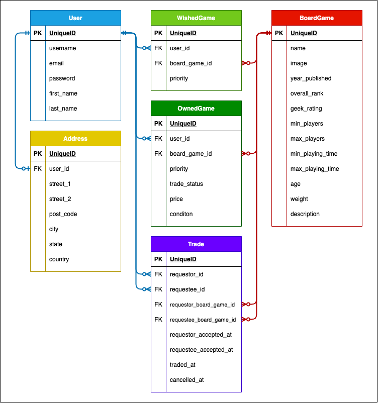

<br>

### **R15 - Components:**

- **API Connector (Rake Task):** 
    - TCC includes an API connector which is used to load board game information into its database (the first time it is loaded on a new server) from the BGG database via the BGG XML API2
    - This API Connector is loosely based on code from an outdated ruby gem which can be found [here](https://github.com/bhardin/bgg-api)
    - Firstly, the API connector constructs a URL that the Board Game Geek (BGG) database is expecting from an API call using the unique board game ids found in their database (to save time I copied these in manually for the top 100 board games)
    ```ruby
    # BGG board game id is 174430 for 'Gloomhaven'
    id = 174430

    response = get("http://www.boardgamegeek.com/xmlapi2/thing?id=#{id}&type=boardgame&stats=1")
    ```
    - Secondly, the API connector sends the URL as a request which then returns a stream of data in XML format
    - Finally, the API Connector searches through the XML, and stores key pieces of data into the `board_games` table
    ```ruby
    bg_hash = xml['item'].map do |item|
        {
            id: item['id'].to_i,
            name: item['name'][0]['value'],
            year: item['yearpublished'][0]['value'],
            image: item['image'][0],
            rank: item['statistics'][0]['ratings'][0]['ranks'][0]['rank'][0]['value'],
            rating: item['statistics'][0]['ratings'][0]['average'][0]['value'],
            min_players: item['minplayers'][0]['value'],
            max_players: item['maxplayers'][0]['value'],
            min_playing_time: item['minplaytime'][0]['value'],
            max_playing_time: item['maxplaytime'][0]['value'],
            age: item['minage'][0]['value'],
            weight: item['statistics'][0]['ratings'][0]['averageweight'][0]['value'],
            description: item['description'][0]
        }
    end
    ```
    - NB! Currently only the top 100 games are able to be imported by the API connector, with any number from 30-100 games loading in each time the rake task is run based on BGG API request load (auto loading of more titles coming in a future release)

- **User Accounts:** 
    - When users first visit the site, they are prompted to sign up for an account (or login if they already have an account)
    - Upon signup, users are given the option to upload an image for use as a user avatar

- **Collections:** 
    - When users press the "Add to Collection" button on the home page or the show page for any individual board game it will create a new instance of an owned_game using the board game's id
    - Users can edit these owned_game instances, which includes the condition of the game, trade status (tradeable? or not_for_trade) and price
    - Users are also able to remove games from their collection
- **Wishlists:** 
    - When users press the "Add to Wishlist" button on the home page or the show page for any individual board game it will create a new instance of a wished_game using the board game's id
    - Users can then see a list of all their wished games and remove any games from their wishlist

- **Trades (Powered by TradeMatch™):** 
    - TCC's innovative TradeMatch™ technology is able to find all users that could fulfill a successful trade of two board games between two users, based on the games in their collections and wishlists
    - This is accomplished by running a series of SQL queries, storing the results in memory and saving user-initiated trade requests to the database (trade request save coming in a future release)
    - The queries that are required to match users are listed below:
    - FIRST TRADE MATCH:
        - **current_user_collection_items:** Search of ALL board games in the current user’s COLLECTION
        - **other_user_wishlist_items:** Search of ALL board games in the WISHLISTS of ALL users EXCEPT the current user
        - **current_game_trades:** Stores ALL board games where there is a match for ALL current_user_collection_items AND ALL other_user_wishlist_items
    - SECOND TRADE MATCH:
        - **other_trade_users:** Search of ALL users EXCEPT the current user that are present in the FIRST TRADE MATCH (reduces # of SQL queries)
        - **other_user_collection_items:** Search of ALL board games in the COLLECTIONS of other_trade_users
        - **current_user_wishlist_items:** Search of ALL board games in the current user’s WISHLIST
        - **other_game_trades:** Stores all board games where there is a match for ALL other_user_collection_items AND ALL current_user_wishlist_items
    - FINAL TRADE MATCH:
        - **trades:** Search of ALL viable trades between two users where each user has a wishlist item in the other user’s collection, by combining the results of FIRST TRADE MATCH and SECOND TRADE MATCH

<br>

### **R16 - 3rd Party Services:**

- **BGG XML API2:**
    - An open API provided by Board Game Geek (BGG) to access detailed information about any board game (and a host of other items) stored in their database (which includes a list of over 100,000 titles)
    - The API requires a formatted URL as input, and returns XML containing all requested data
    - TCC API Connector that leverages the BGG XML API2 uses the following gems to support the transfer of data between the two applications:
        - HTTParty: Ruby gem used to send requests to a website API and consume data from API requests
        - XML Simple: Ruby gem that converts XML to Ruby objects for easy data manipulation
- **Heroku:**
    - A cloud platform that offers hassle-free website and application hosting in the public cloud (running on AWS EC2 service)
- **AWS:**
    - On-demand public cloud computing services. TCC uses the following AWS services:
        - Simple Storage Service (S3): Simple object storage, used by TCC for storing user uploaded images
    - Identity and Access Management (IAM): A solution allowing programmatic access to AWS services, used by TCC to manage individual user access to S3 storage
- **Gems:**
    - Devise: A gem for athenticating and authorising users of TCC

<br>

### **<a name="txt17.1">R17</a> - Models:**

" Rails supports six types of associations:
- belongs_to
- has_one
- has_many
- has_many :through
- has_one :through
- has_and_belongs_to_many "

*Sourced from [[17.1.1]](#ref17.1.1)*

**List of all models:**

| | |
--- | ---
**Users** | Board game enthusiasts
**Addresses** | Physical address of a user
**Board Games** | Library of all board games
**Wished Games** | List of all board games all users wish to acquire
**Collections** | List of all board games all users own
**Trades** | A list of all board game trade matches between wishlists and collections from different users 
**Attachments/Blobs** | Attached pictures for users' avatar image 

<br>

Relationships:
- A User `has_one` Address, an Address `belongs_to` a user
- A User `has_many` Board Games `:through` Wishlists
- A User `has_many` Board Games `:through` Collections
- A User `has_one` Wishlist, a Wishlist `belongs_to` a user
- A User `has_one` Collection, a Collection `belongs_to` a user

- A User `has_many` Trades, a Trade


<br>

### **R18 - Database Relations:**

<br>

### **R19 - Database Schema Design:**

```ruby
create_table "active_storage_attachments", force: :cascade do |t|
    t.string "name", null: false
    t.string "record_type", null: false
    t.bigint "record_id", null: false
    t.bigint "blob_id", null: false
    t.datetime "created_at", null: false
    t.index ["blob_id"], name: "index_active_storage_attachments_on_blob_id"
    t.index ["record_type", "record_id", "name", "blob_id"], name: "index_active_storage_attachments_uniqueness", unique: true
  end

  create_table "active_storage_blobs", force: :cascade do |t|
    t.string "key", null: false
    t.string "filename", null: false
    t.string "content_type"
    t.text "metadata"
    t.bigint "byte_size", null: false
    t.string "checksum", null: false
    t.datetime "created_at", null: false
    t.index ["key"], name: "index_active_storage_blobs_on_key", unique: true
  end

  create_table "addresses", force: :cascade do |t|
    t.datetime "created_at", precision: 6, null: false
    t.datetime "updated_at", precision: 6, null: false
    t.bigint "user_id"
    t.text "street_1"
    t.text "street_2"
    t.text "post_code"
    t.text "city"
    t.text "state"
    t.text "country"
    t.index ["user_id"], name: "index_addresses_on_user_id"
  end

  create_table "board_games", force: :cascade do |t|
    t.datetime "created_at", precision: 6, null: false
    t.datetime "updated_at", precision: 6, null: false
    t.text "name"
    t.integer "year_published"
    t.integer "overall_rank"
    t.float "geek_rating"
    t.integer "min_players"
    t.integer "max_players"
    t.integer "min_playing_time"
    t.integer "max_playing_time"
    t.integer "age"
    t.float "weight"
    t.text "long_description"
    t.text "image"
  end

  create_table "owned_games", force: :cascade do |t|
    t.datetime "created_at", precision: 6, null: false
    t.datetime "updated_at", precision: 6, null: false
    t.bigint "user_id", null: false
    t.bigint "board_game_id", null: false
    t.integer "priority"
    t.integer "trade_status"
    t.decimal "price"
    t.integer "condition"
    t.index ["board_game_id"], name: "index_owned_games_on_board_game_id"
    t.index ["user_id"], name: "index_owned_games_on_user_id"
  end

  create_table "trades", force: :cascade do |t|
    t.datetime "created_at", precision: 6, null: false
    t.datetime "updated_at", precision: 6, null: false
    t.bigint "requestor_id", null: false
    t.bigint "requestee_id", null: false
    t.bigint "requestor_board_game_id", null: false
    t.bigint "requestee_board_game_id", null: false
    t.datetime "requestor_accepted_at"
    t.datetime "requestee_accepted_at"
    t.datetime "traded_at"
    t.datetime "cancelled_at"
    t.index ["requestee_board_game_id"], name: "index_trades_on_requestee_board_game_id"
    t.index ["requestee_id"], name: "index_trades_on_requestee_id"
    t.index ["requestor_board_game_id"], name: "index_trades_on_requestor_board_game_id"
    t.index ["requestor_id"], name: "index_trades_on_requestor_id"
  end

  create_table "users", force: :cascade do |t|
    t.string "email", default: "", null: false
    t.string "encrypted_password", default: "", null: false
    t.string "reset_password_token"
    t.datetime "reset_password_sent_at"
    t.datetime "remember_created_at"
    t.datetime "created_at", precision: 6, null: false
    t.datetime "updated_at", precision: 6, null: false
    t.text "username"
    t.text "first_name"
    t.text "last_name"
    t.index ["email"], name: "index_users_on_email", unique: true
    t.index ["reset_password_token"], name: "index_users_on_reset_password_token", unique: true
  end

  create_table "wished_games", force: :cascade do |t|
    t.datetime "created_at", precision: 6, null: false
    t.datetime "updated_at", precision: 6, null: false
    t.bigint "user_id", null: false
    t.bigint "board_game_id", null: false
    t.integer "priority"
    t.index ["board_game_id"], name: "index_wished_games_on_board_game_id"
    t.index ["user_id"], name: "index_wished_games_on_user_id"
  end

  add_foreign_key "active_storage_attachments", "active_storage_blobs", column: "blob_id"
  add_foreign_key "addresses", "users"
  add_foreign_key "owned_games", "board_games"
  add_foreign_key "owned_games", "users"
  add_foreign_key "trades", "board_games", column: "requestee_board_game_id"
  add_foreign_key "trades", "board_games", column: "requestor_board_game_id"
  add_foreign_key "trades", "users", column: "requestee_id"
  add_foreign_key "trades", "users", column: "requestor_id"
  add_foreign_key "wished_games", "board_games"
  add_foreign_key "wished_games", "users" 
  ```

<br>

### **R20 - Task Management:**

- The TCC project was managed using Trello ([link to board here](https://trello.com/b/be7PLvGD/waldow-marketplace)) and followed the principles of Agile development
- The board makes use of labels to define different types of tasks into one of two options in two categories:
    - Category 1: Task Type
        - Options: Code, Documentation
    - Category 2: Required?
        - Options: Required, Optional
- Cards were stored in one of four columns, and would contain individual features, groups of features or bugs that needed fixing:
    - Backlog: All ideas and features to be implemented, including optional features
    - In Progress: Features that have been started
    - Review/Testing: Features that were complete but required some review or testing
    - Completed: Features that have been completed

<br>

<br>

<br>

### *References:*

[^](#txt17.1)<a name="ref17.1.1">17.1.1 - </a>Rails Guides. 2012. Active Record Associations. [ONLINE] Available at: [Link](https://guides.rubyonrails.org/association_basics.html). [Accessed 6 November 2020].

<br>

Notes:

[^](#txtX.1)<a name="refX.1.X">X.1.X - </a>WebsiteName. Year. WebPageTitle. [ONLINE] Available at: [Link](). [Accessed 6 November 2020].

<a name="txt11.1">Question 11</a>

*References: [[11.1.1]](#ref11.1.1), [[11.1.2]](#ref11.1.2), [[11.1.3]](#ref11.1.3)*